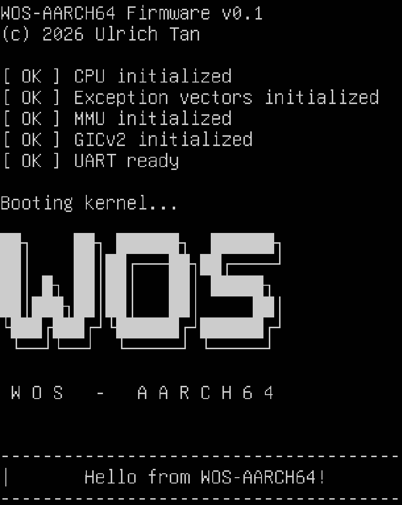
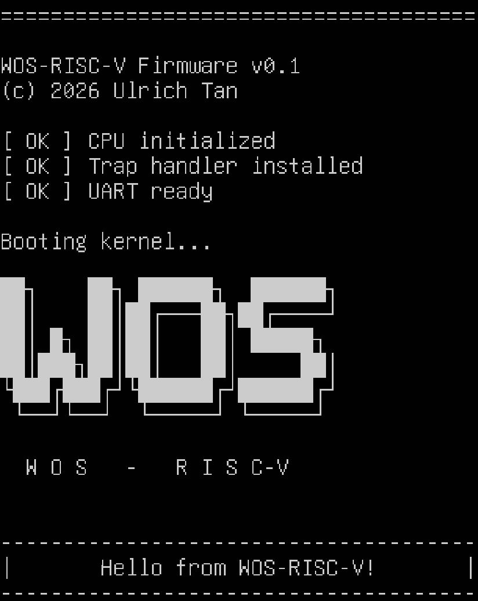

# WOS — W. Operating System

<p align="center">
  
  
</p>


**WOS** is an experimental operating system written in **Rust**, built **from scratch**, now supporting **ARM64/AArch64** *and* **RISC-V (rv64)** architectures. It is a **minimal, clean, educational kernel**, designed to be understandable, hackable, and a solid foundation for OS research.  

## Table of Contents
- [Project Vision](#-project-vision)
- [Multi-Architecture Support](#-multi-architecture-support)
- [Current Features](#-current-features)
- [Project Structure](#-project-structure)
- [Prerequisites](#-prerequisites)
- [Build Instructions](#build-instructions-)
- [Run in QEMU (ARM64)](#️-run-in-qemu-arm64)
- [Run in QEMU (RISC-V)](#️-run-in-qemu-risc-v)
- [Current Status](#-current-status)
- [Roadmap](#️-roadmap-kernel)
- [Contributing](#-contributing)
- [License](#-license)

---

## 🎯 Project Vision

WOS is a research‑driven exploration of how operating‑system foundations might evolve in an era where adaptive, learning‑based components become pervasive. It has two complementary goals:

### 1. **A minimal and educational Rust OS (ARM64 + RISC-V)**
WOS provides a clear, modern, and understandable foundation for learning:
- how to boot ARM64 and RISC-V CPUs    
- how to write a Rust kernel without a runtime (`no_std`, `no_main`)  
- how to configure the ARM64 MMU
- how to manage physical memory  
- how interrupts, traps, and exceptions work
- how to implement a scheduler and context switching

It is ideal for:
- systems programming students  
- Rust developers curious about OS internals  
- researchers needing a minimal multi-arch environment
- people wanting a simple ARM64 or RISC-V kernel    
- hobbyists building their own OS

### 2. **A future platform for an AI‑native operating system**
WOS is also the foundation for a broader research direction exploring the idea of an AI‑native OS.

> Note: AI components are not part of the public codebase. 

---

## 🏗️ Multi‑Architecture Support

### ✔ ARM64 / AArch64
- custom bootloader
- EL1 initialization
- full MMU setup (MAIR, TCR, TTBR0, SCTLR)
- 4‑level page tables (L0/L1/L2/L3)
- UART
- GICv2 interrupts
- CNTP timer
- physical page allocator
- preemptive process scheduler (round‑robin)
- full context switching (x0..x30, SP, ELR, SPSR)

### ✔ RISC‑V (rv64) — Early bring‑up
- custom bootloader
- stack setup
- Rust entry
- UART output
- trap handler (Rust + trap.S)
- early exception debugging
- working linker script
- custom target JSON

Architecture‑specific code lives in:
```
kernel/src/arch/
  ├── aarch64/
  └── riscv64/
```
---

## ✨ Current Features

- Rust kernel (`no_std`, `no_main`)
- Custom boot code for ARM64 and RISC‑V
- UART driver (console output)
- [ARM64] exception handling (synchronous exceptions, data aborts, FP/SIMD traps)
- [ARM64] MMU + page tables
- [ARM64] Physical page allocator (4K pages)
- [ARM64] Identity‑mapped MMIO (UART, GIC, timer)
- [ARM64] GICv2 interrupt subsystem
- [ARM64] CNTP timer interrupts
- [ARM64] Process‑based scheduler (round‑robin)
- [ARM64] Pure ASM context switching
- [ARM64] IRQ‑driven preemption
- [RISC‑V] trap handling

> **Note (ARM64):**  
> Device MMIO is currently accessed through identity-mapped physical addresses. This simplifies early bring-up of interrupts and timers. A full high-half kernel layout (KERNEL_BASE / DEVICE_BASE in the 0xFFFF_… range) will be enabled now that IRQs, timers, and the scheduler are stable.

---

## 📁 Project Structure

```
/docs                   # Technical documentation
/kernel
  ├── src
  │   ├── arch/aarch64  # ARM64-specific code
  │   ├── arch/riscv64  # RISC-V-specific code
  │   ├── memory        # Memory management
  │   ├── drivers       # UART, future DTB parsing, etc.
  │   ├── debug         # Debug helpers
  │   ├── utils         # Printing, helpers
  │   └── main.rs       # Kernel entry point (Rust)
  ├── linker/           # Linker scripts per architecture
  ├── targets/          # Custom Rust target JSON files
  ├── build.rs          
  └── virt.dtb          # QEMU DTB (ARM64)
```

---

## 🧰 Prerequisites
WOS requires:
- Rust nightly
- clang / LLVM (for assembling start.S via build.rs)
- QEMU with ARM64 and RISC‑V support

On Debian/Ubuntu:
```bash
sudo apt install clang llvm qemu-system-arm qemu-system-misc
```

On Apple Silicon, use `UTM` for stable ARM64 virtualization.

---

## 🛠️ Build Instructions

### Build for ARM64
```bash
cd kernel
cargo build --target targets/aarch64-wos.json
```

### Build for RISC‑V
```bash
cd kernel
cargo build --target targets/riscv64-wos.json
```

---

## ▶️ Run in QEMU (ARM64)
Generate the QEMU virt machine DTB once in the `kernel` Directory:
```bash
qemu-system-aarch64 \
    -M virt \
    -cpu cortex-a72 \
    -machine dumpdtb=virt.dtb \
    -nographic
```

Run the kernel:
```bash
qemu-system-aarch64 \
    -M virt \
    -cpu cortex-a72 \
    -kernel target/aarch64-wos/debug/kernel \
    -dtb virt.dtb \
    -nographic
```

Or build an image,
```bash
rust-objcopy --strip-all -O binary target/aarch64-wos/debug/kernel kernel8.img
```
and run the kernel from this image:
```bash
qemu-system-aarch64   -M virt   -cpu cortex-a72   -kernel kernel8.img   -nographic
```

> Note (ARM64): Interrupt Controller (GIC)
>
> WOS now includes **working GICv2 initialization** (Distributor + CPU interface + Timer PPI + SGI). At this stage, the kernel still uses **identity-mapped physical addresses** for MMIO (e.g., UART at 0x0900_0000, GICD at 0x0800_0000), because the high-half virtual address space (DEVICE_BASE at 0xFFFF_FD00_0000_0000) is not enabled yet.
>
> This is intentional: interrupts, timers, and exception handling are brought up first in a simple identity-mapped environment before enabling the full high-half kernel with TTBR1 and virtualized device mappings.

> Note (ARM64): Timer (CNTP) and SGI interrupts are now fully working under GICv2 in the identity‑mapped early kernel.

## ▶️ Run in QEMU (RISC‑V)
Run **without OpenSBI** (`-bios none`):

```bash
qemu-system-riscv64 \
    -M virt \
    -cpu rv64 \
    -kernel target/riscv64-wos/debug/kernel \
    -nographic \
    -bios none
```

---

## 🧵 Scheduler & Context Switching (ARM64)

WOS now includes a **stable, process‑based preemptive scheduler** on ARM64.

### ✔ Architecture
- Process Control Block (PCB) stored in `PROCS[]`
- CPU context stored separately in `CTX[]` (fixed 272‑byte layout)
- Kernel stack per process
- Pure AArch64 context switch (save/restore x0..x30, SP, ELR, SPSR)
- IRQ‑driven preemption using CNTP timer (PPI 30)
- Round‑robin scheduling

### ✔ IRQ pipeline
- `irq_entry` (ASM) saves the interrupted process context
- Rust scheduler selects the next process
- `irq_entry` restores the next process context
- `eret` jumps directly into the new process

### ✔ Why this design
Separating the PCB from the CPU context ensures:
- stable stride for ASM context switching
- clean Rust‑side process management
- extensibility toward user space, MMU switching, and isolation

> This architecture matches how other kernels (Linux, seL4, FreeRTOS) structure process management.

---

## 📌 Current Status

WOS is a functional minimal kernel, ready for:
- virtual memory per process
- user space
- ELF loader
- drivers
- advanced scheduling

ARM64 is stable; RISC‑V is in early bring‑up.

---

## 🗺️ Roadmap

### ARM64

- [x] Boot + Rust kernel
- [x] UART output
- [x] MMU + page tables
- [x] Physical page allocator
- [x] GICv2 interrupt subsystem (Distributor + CPU interface + timer PPI + SGI)
- [x] Timer interrupts (CNTP, PPI 30)
- [x] SGI delivery (IPI)
- [x] Process scheduler (round‑robin)
- [x] Full context switching
- [ ] Per‑process virtual memory (TTBR0 switching)
- [ ] User space (EL0)
- [ ] High-half kernel mapping (TTBR1)
- [ ] Heap allocator
- [ ] Drivers (UART, timer, virtio)
- [ ] ELF loader

### RISC‑V

- [x] Boot + Rust entry
- [x] UART
- [x] Trap handler (mstatus, mtvec, mepc, mcause, mtval)
- [ ] Interrupt handling (timer + external)
- [ ] Sv39 MMU
- [ ] Virtual memory
- [ ] Scheduler

---

## 🤝 Contributing
Contributions are welcome — especially in the areas of:
- ARM64 bring‑up
- RISC‑V bring‑up
- Rust `no_std`
- Memory management
- Exception handling
- Drivers
- Documentation

### ✔️ Kernel contributions follow MIT license
All code submitted to this repository will be licensed under the MIT License, consistent with the rest of the kernel.

### ✔️ AI‑native components are not open to contribution
The AI‑native runtime and related modules are **not part of this repository** and remain closed‑source and proprietary.
They are developed separately and are **not open to direct code contributions**.

However, **high‑level discussions, conceptual feedback, and private exchanges about the AI‑native architecture are welcome**.
If you are interested in the research direction or want to discuss ideas, feel free to open an issue or reach out privately.

### ✔️ Code style & expectations
- Rust nightly
- `no_std`, `no_main`
- Minimal dependencies
- Clear, well‑commented low‑level code
- Small, focused pull requests

### ✔️ How to contribute
1. Fork the repository
2. Create a feature branch
3. Submit a pull request with a clear description
4. Keep the scope minimal and focused

If you're unsure whether a contribution fits the project, feel free to open an issue first.

---

## 📜 License
WOS uses a **dual licensing model**:

### **1. Kernel (this repository) — MIT License**
All publicly available components of WOS are released under the **MIT License**.  
This makes the kernel freely usable for learning, experimentation, and derivative work.

### **2. AI‑native components — Proprietary**
The AI‑native runtime and related modules are **not included in this repository** and remain **closed‑source and proprietary**.  
They will be distributed separately and are not covered by the MIT license.

See the [LICENSE](LICENSE) file for details.