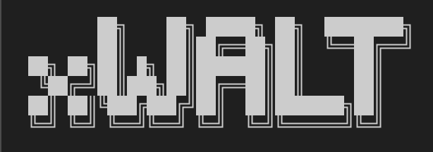

# xWALT — Lean Rust Hypervisor & Minimal OS Stack

## Safety‑critical virtualization for embedded robotics, drones, autonomous systems, and AI‑secure workloads

<p align="center">
  
</p>


**xWALT** is a clean, lean, multi‑architecture (ARM, RISC-V) virtualization and operating‑system stack written in **Rust**, designed for **safety‑critical embedded systems, robotics, drones, autonomous vehicles**, and **AI‑secure execution environments**.  

It is composed of three layers:
- **hWALT** — a minimal, certifiable-friendly **hypervisor** (ARM EL2, RISC‑V HS-mode planned)
- **kWALT** — a compact **kernel** (ARM EL1 / RISC‑V S-mode)
- **uWALT** — a tiny **userland** (EL0 / U-mode)

xWALT focuses on **isolation, determinism, memory safety**, and **auditability**, making it suitable for environments where correctness and trust boundaries matter.

## Table of Contents
- [Project Vision](#-project-vision)
- [Architecture Overview](#-architecture-overview)
- [Current Features](#-current-features)
- [Project Structure](#-project-structure)
- [Prerequisites](#-prerequisites)
- [Build Instructions](#build-instructions-)
- [Run in QEMU (ARM64)](#️-run-in-qemu-arm64)
- [Run in QEMU (RISC-V)](#️-run-in-qemu-risc-v)
- [Current Status](#-current-status)
- [Roadmap](#️-roadmap-kernel)
- [Contributing](#-contributing)
- [License](#-license)

---

## 🎯 Project Vision

### 1. **A lean, certifiable Rust hypervisor (hWALT)**
hWALT is designed to be:
- **minimal** — small trusted computing base
- **memory‑safe** — Rust, no undefined behavior
- **deterministic** — predictable control flow
- **auditable** — simple architecture, clear invariants
- **portable** — ARM64 EL2 today, RISC‑V HS-mode tomorrow

This makes hWALT suitable for:
- drones and UAVs
- robotics platforms
- automotive ECUs
- industrial controllers
- embedded AI accelerators

Where strict isolation is required between:
- navigation
- sensor fusion
- flight control
- perception models
- communication subsystems

### 2. **Security for AI workloads**
Modern AI systems require:
- **strong isolation** between models
- **trusted execution** for safety‑critical inference
- **sandboxing** of untrusted agents
- **deterministic scheduling**
- **verified memory boundaries**

xWALT provides a foundation for **AI‑secure execution**, where the hypervisor enforces strict boundaries between:
- control logic
- perception models
- planning modules
- external communication 

### 3. **A minimal OS for research, education, and embedded systems**
kWALT + uWALT form a tiny OS stack:
- simple MMU
- minimal scheduler
- userland execution
- clean Rust code
- no legacy baggage

Ideal for:
- learning OS internals
- experimenting with virtualization
- prototyping embedded systems
- teaching systems programming
- building custom kernels

---

## 🏗️ Architecture Overview

```
xWALT
 ├── hWALT   # Hypervisor (EL2 / HS-mode)
 ├── kWALT   # Kernel (EL1 / S-mode)
 └── uWALT   # Userland (EL0 / U-mode)
```

### ✔ ARM64 / AArch64
#### Hypervisor (EL2 early bring‑up stage)
- EL2 boot and CPU initialization
- EL2 exception vectors
> hWALT currently provides the firmware‑like EL2 environment and isolation groundwork, but **does not yet implement full virtualization or guest VM management**.
#### Kernel (EL1)
- Full MMU + page tables setup (MAIR, TCR, TTBR0/TTBR1, 4‑level page tables)
- High‑half kernel mapping
- UART, GICv2, CNTP timer
- Scheduler (round‑robin)
- Full context switching
- Exception handling (sync exceptions, aborts, FP/SIMD traps)
#### Userland EL0 with syscalls (svc)
- Userland (EL0)
- Dedicated user stack
- User text/data sections
- Syscall ABI
- Minimal shell

### ✔ RISC‑V (rv64) — Early bring‑up
- Boot without OpenSBI (`-bios none`)
- Rust entry
- UART output
- Trap handler (Rust + trap.S)
- Early exception debugging

Architecture‑specific code lives in:
```
kernel/src/arch/
  ├── aarch64/
  └── riscv64/
```
---

## ✨ Current Features
### Hypervisor (hWALT)
- [ARM64] EL2 initialization
### Kernel (kWALT)
- Rust kernel (`no_std`, `no_main`)
- Multi‑arch boot code
- [ARM64] MMU + page tables
- [ARM64] High‑half virtual memory
- [ARM64] Page allocator
- [ARM64] Exception handling (synchronous exceptions, data aborts, FP/SIMD traps)
- [ARM64] GICv2 interrupt subsystem
- [ARM64] Scheduler (round‑robin)
- [ARM64] Full context switching
- [ARM64] Timer interrupts
- [RISC‑V] trap handling (mstatus, mtvec, mepc, mcause, mtval)
### Userland (uWALT)
- Dedicated user stack
- User text/data sections
- Syscalls (svc / ecall)
- Minimal shell
- Architecture‑specific syscall ABI
- Clean separation from kernel

---

## 📁 Project Structure

```
/docs                   # Technical documentation
/kernel
  ├── src
  │   ├── arch/aarch64  # Hypervisor + kernel + syscalls
  │   ├── arch/riscv64  # Boot + traps + syscalls
  │   ├── user          # uWALT userland
  │   ├── memory        # Memory management
  │   ├── drivers       # UART, future DTB parsing, etc.
  │   ├── debug         # Debug helpers
  │   ├── utils         # Printing, helpers
  │   └── main.rs       # Kernel entry point (Rust)
  ├── linker/           # Linker scripts per architecture
  ├── targets/          # Custom Rust target JSON files
  ├── build.rs          
  └── virt.dtb          # QEMU DTB (ARM64)
```

---

## 🧰 Prerequisites
xWALT is designed to run on a certifiable Rust subset (Ferrocene‑compatible), enabling hWALT to serve as a lean, deterministic, safety‑critical hypervisor for embedded robotics, drones, autonomous systems, and AI‑secure workloads.

xWALT requires:
- **Rust stable** (no nightly features)
- **lld** (LLVM linker)
- **clang** (compiling .S assembly files)
- **QEMU** with ARM64 and RISC‑V support

On Debian/Ubuntu:
```bash
sudo apt install lld clang qemu-system-arm qemu-system-misc
```

Use Rust stable:
```bash
rustup override unset
rustup override set stable
rustup target add aarch64-unknown-none-softfloat --toolchain stable
rustup target add riscv64gc-unknown-none-elf --toolchain stable
```
>Nightly is **not recommended** for certifiable Rust.
JSON target files (*.json) require nightly-only flags and cannot be used with Rust stable or Ferrocene.

On Apple Silicon, use `UTM` for stable virtualization.

---

## 🛠️ Build Instructions

### ARM64 (Rust stable)
```bash
cd kernel
cargo +stable build --target aarch64-unknown-none-softfloat
```
> Nightly-only alternative (not certifiable): `cargo build --target targets/aarch64-wos.json`

### RISC‑V (Rust stable)
```bash
cd kernel
cargo +stable build --target riscv64gc-unknown-none-elf
```
> Nightly-only alternative (not certifiable): `cargo build --target targets/riscv64-wos.json`

---

## ▶️ Run in QEMU (ARM64)
Generate the QEMU virt machine DTB once in the `kernel` Directory:
```bash
qemu-system-aarch64 \
    -M virt \
    -cpu cortex-a72 \
    -machine dumpdtb=virt.dtb \
    -nographic
```
### Kernel (EL1)
```bash
qemu-system-aarch64 \
    -M virt \
    -cpu cortex-a72 \
    -kernel target/aarch64-unknown-none-softfloat/debug/kernel \
    -dtb virt.dtb \
    -nographic`
```

> Nightly-only JSON target: `qemu-system-aarch64 -M virt -cpu cortex-a72 -kernel target/aarch64-wos/debug/kernel -dtb virt.dtb -nographic`

#### Optional: build a raw image
```bash
llvm-objcopy --strip-all -O binary \
    target/aarch64-unknown-none-softfloat/debug/kernel kernel8.img
```
Run:
```bash
qemu-system-aarch64 \
    -M virt \
    -cpu cortex-a72 \
    -kernel kernel8.img \
    -nographic
```
### Hypervisor (EL2)
```bash
qemu-system-aarch64 \
    -M virt,virtualization=on \
    -cpu cortex-a72 \
    -kernel target/aarch64-unknown-none-softfloat/debug/kernel \
    -dtb virt.dtb \
    -nographic
```

## ▶️ Run in QEMU (RISC‑V)
Run **without OpenSBI** (`-bios none`):

```bash
qemu-system-riscv64 \
    -M virt \
    -cpu rv64 \
    -kernel target/riscv64gc-unknown-none-elf/debug/kernel \
    -nographic \
    -bios none
```
> Nightly-only JSON target: 
`qemu-system-riscv64 \
    -M virt \
    -cpu rv64 \
    -kernel target/riscv64-wos/debug/kernel \
    -nographic \
    -bios none`

---

## 🧵 Scheduler & Context Switching (ARM64)

xWALT[ARM64] includes a **stable, process‑based preemptive scheduler**.

### ✔ Architecture
- Process Control Block (PCB) stored in `PROCS[]`
- CPU context stored separately in `CTX[]` (fixed 272‑byte layout)
- Kernel stack per process
- Pure AArch64 context switch (save/restore x0..x30, SP, ELR, SPSR)
- IRQ‑driven preemption using CNTP timer (PPI 30)
- Round‑robin scheduling

### ✔ IRQ pipeline
- `irq_entry` (ASM) saves the interrupted process context
- Rust scheduler selects the next process
- `irq_entry` restores the next process context
- `eret` jumps directly into the new process

### ✔ Why this design
Separating the PCB from the CPU context ensures:
- stable stride for ASM context switching
- clean Rust‑side process management
- extensibility toward user space, MMU switching, and isolation

> This architecture matches how other kernels (Linux, seL4, FreeRTOS) structure process management.

---

## 📌 Current Status
kWALT[ARM64] is stable.
uWALT[ARM64] is at an early stage (first syscall).
hWALT[ARM64] and kWALT[RISC‑V] are in early bring‑up.

---

## 🗺️ Roadmap
> 🚧 **Current Limitations**  
hWALT is a minimal, deterministic EL2 hypervisor designed for research, education, and safety‑critical experimentation.
It is **not yet a full virtualization stack**.  
Planned features include:
>- **Stage‑2 translation (second‑level MMU)** for full guest memory virtualization
>- **Virtual interrupt controller (VGIC)** for proper guest interrupt routing
>- **Guest VM creation and scheduling**
>- **IOMMU / SMMU support** for DMA isolation  
>- **Hardware‑assisted isolation for AI workloads** (AI‑Secure vision)
>
>These features are part of the long‑term roadmap and will progressively evolve as xWALT matures.
### Hypervisor (hWALT)
- [ ] RISC‑V HS-mode
- [ ] VM creation API
- [ ] Virtual devices
- [ ] Static partitioning mode
- [ ] Certifiable configuration (no dynamic alloc)
### Kernel (kWALT)
- [ ] Per‑process TTBR0
- [ ] ELF loader
- [ ] VirtIO drivers
- [ ] IPC primitives
### Userland (uWALT)
- [ ] Minimal libc
- [ ] Shell commands
- [ ] Process spawning
- [ ] File system prototype

---

## 🤝 Contributing
All code submitted to this repository will be licensed under the MIT License.

### ✔️ Code style & expectations
- **Rust stable** (Ferrocene‑compatible subset)
- `no_std`, `no_main`
- No allocations in privileged code (EL2/EL1)
- Minimal dependencies
- Clear comments for all unsafe blocks
- Deterministic, predictable low‑level code (no randomness, no panics in critical paths)
- No unstable Rust features
- Small, focused pull requests

Nightly builds using JSON targets are allowed but **not recommended**.

### ✔️ How to contribute
1. Fork the repository
2. Create a feature branch
3. Submit a pull request with a clear description
4. Keep the scope minimal and focused

If you're unsure whether a contribution fits the project, feel free to open an issue first.

---

## 📜 License

All publicly available components are released under the **MIT License**.  

See the [LICENSE](LICENSE) file for details.